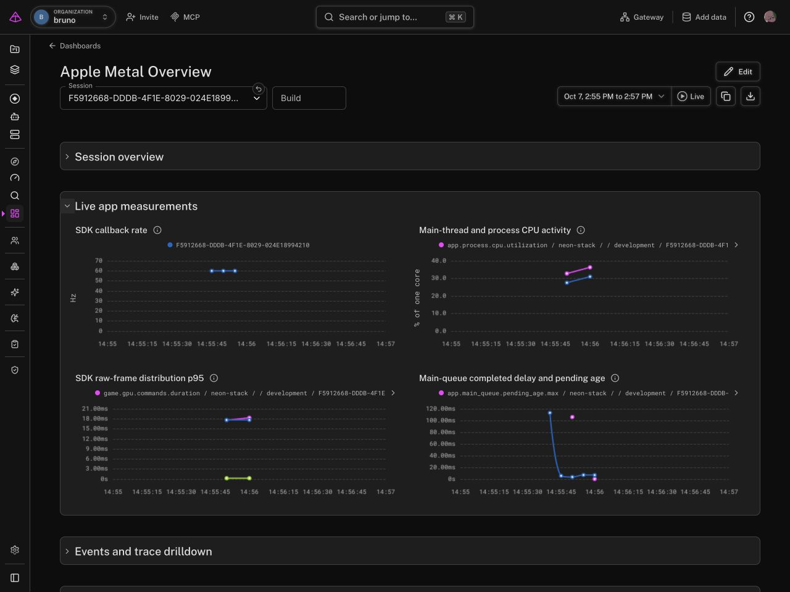

# Apple Metal + Logfire

A macOS developer toolkit for Metal games. Find a slow session, connect it to its build, and inspect the app and Apple profiler evidence together in Logfire.

**Community developer preview.** The API can change. Complete hosted CPU Profiles is a separate experiment and is not required for the toolkit.

The toolkit has three parts:

- **LogfireSwift** adds app operations, frame distributions, responsiveness probes, and Apple state context.
- **logfire-apple** runs builds and app-owned scenarios, samples host context, and imports native CPU/GPU evidence.
- **Dashboard templates** make sessions, build identity, investigation findings, and measurement coverage easy to inspect.

Log Roll, Flappy Log, and Neon Stack are the reference workloads. This is a community prototype for trusted developer and manual tester machines.
It is not an official released Logfire SDK.



The [React showcase](video/README.md) presents dashboards, game input spans, build correlation, and native investigations in 77 seconds.
Its animated FPS improvement shows the collaborator's reported Log Roll fix. The separate measured five-run CPU case remains available below.

## Configure this Mac

Use Xcode 27 and its Metal toolchain. Configure a project write token once.

```sh
git clone https://github.com/bruno-espino/neon-stack-logfire.git
cd neon-stack-logfire
tools/install-companion.sh
~/.local/bin/logfire-apple configure --region us
~/.local/bin/logfire-apple doctor --send
```

The configuration command hides token input and saves a private runtime file outside the application and Git.
Ordinary runs export directly. They need no Python, relay, or observer daemon.

## Run the reference game

```sh
open examples/neon-stack/NeonStack.xcodeproj
```

Select **NeonStack / My Mac** and press **Command-R**.
The game still runs if telemetry is unavailable. The [game guide](examples/neon-stack/README.md) covers controls and workloads.

## Add the SDK to your own app

Add `https://github.com/bruno-espino/neon-stack-logfire.git` as a Swift package dependency.
Link the **LogfireSwift** product. Pin a reviewed revision for a reproducible pilot; the project has no release tags yet.
Enable `LOGFIRE_DEV_DIRECT=1` in your development scheme and retain one client.

```swift
import LogfireSwift

let telemetry = try Logfire.development(serviceName: "my-game")
telemetry.withSpan("game.load") {
    loadLevel()
}
```

Add `FrameRecorder` and the independent responsiveness monitor for performance measurements.
The [SDK guide](docs/swift-sdk.md) explains direct configuration, Metal callbacks, signposts, and delayed MetricKit reports.
The SDK supports macOS 14 and iOS 17. The deeper native companion workflows require macOS 27 and Xcode 27.
Physical iOS runtime and real daily MetricKit delivery remain unverified.
The independent [Swift 6 consumer](examples/sdk-consumer/README.md) pins a reviewed public revision and links only the SDK product.
Use it on a tester Mac to verify setup, async parentage, and live delivery before a wider pilot.

## Inspect a session

Import [Apple Metal Overview](dashboards/apple-metal-overview.json) into Logfire.
Choose the measurement time range. Its session selector discovers SDK sessions automatically.
The 12-panel overview starts with compact session summaries, including launches without a complete renderer window.
It shows callback rate beside presented FPS, CPU activity, slow-frame share, and queue delay.
Expand live measurements, gameplay events, builds, host context, or native evidence as needed.
The overview starts with the last 15 minutes. Select one session and zoom to its measurement interval for a readable timeline.
Charts retain five-second buckets. Isolated observations remain dots, and stopped sessions remain separate.
Short source labels preserve distinct metric identities. Detailed GPU distributions and profiler tables live on the investigation dashboard.
Open the runtime or build trace directly from the session window table.
Use [Apple Development Workflow](dashboards/apple-development.json) for the complete 28-panel investigation dashboard.

| Evidence | Producer | Availability |
| --- | --- | --- |
| Operations, gameplay events, frame histograms, queue delay and CPU windows | App + Swift SDK | During app sessions |
| Host load and memory context | Native companion | During builds, scenarios and live attach |
| Build timing and task totals | Companion + Xcode | During and after a build |
| Presented frame cadence | Swift SDK + Metal drawable observation | During onscreen sessions |
| Layer and process resource measurements | Apple tools + companion | Live attach or retained capture |
| Running CPU callers, GPU replay costs, native thread states and drawable waits | Apple tools + companion | Targeted capture and analysis |
| Daily metrics and selected diagnostics | MetricKit + SDK adapter | Apple's delayed delivery |

Frame summaries are structured logs. Actual operations are spans. Raw frame distributions use the OTel metrics pipeline.
Builds have their own traces. Automated runs connect SDK records under `development.run`.
Offline imports carry the original run trace ID, session ID and capture ID in a separate analysis trace.
Manual Command-R records share session/build identity; they do not automatically share one root span.

The SDK reports callback cadence and optional presented FPS separately. GPU command sums differ from utilization.
Native wait intervals overlap CPU states. Replay shader costs describe the captured replay.
See [the telemetry catalog](docs/telemetry-metrics.md) and [dashboard and trace review](docs/session-review.md) for the exact scopes.
The [measured CPU case](docs/cpu-investigation.md) verifies CPU savings with callback rate near 60 Hz.

## Investigate and verify

```sh
logfire-apple run --app PATH_TO_APP \
  --scenario examples/neon-stack/scenarios/log-roll-two-mazes.json
logfire-apple diagnose --report PATH_TO_REPORT_JSON
```

Add `--profile cpu`, `--profile gpu`, or `--profile shader` for a targeted investigation.
The companion retains raw captures locally and exports selected summaries.
Offline diagnosis reuses evidence without another gameplay run or upload.
See [the native workflow](docs/native-workflow.md) for builds, live attach, imports, comparisons, deadlines, and exit codes.

```sh
tools/check-dev.sh          # Local checks and cached macOS Debug build
tools/check-dev.sh --smoke  # Also run a short SDK session
tools/check-presentation.sh # Opt-in normal versus half-rate onscreen verification
tools/check-preview.sh --app PATH_TO_APP --probe PATH_TO_PRESENTATION_PROBE --repeat 5
```

The preview audit is opt-in. It runs five workload policies repeatedly and one 60-second onscreen session.
It retains every case and checks local delivery receipts. Reconcile its retained evidence with Logfire before claiming complete delivery.
It is a coverage check, not a performance baseline on a busy Mac.

Default checks add no profiler, Simulator, or Xcode CI. The normal scenario app deadline remains 20 seconds.
The [presentation verification](examples/presentation-probe/README.md) checks a controlled submission policy through real scenario reports and diagnosis.
CPU recording runs alongside app polling. The companion reaps the app, waits for recorder finalization, and then decodes the capture.
It starts from verified SDK identity and can include startup. GPU capture still waits for scenario readiness.
Optional profiling can extend the command beyond the app deadline. Ctrl-C cancels the owned app, CPU recorder, and CPU export commands.
Native app launch and concurrent GPU/timeline recording still need consolidation before a fully unattended timeline workflow.
The exporter has bounded batches and no persistent offline queue. Abrupt debugger stops can lose the final batch.

[PROJECT.txt](docs/PROJECT.txt) gives the compact terminology. [WORKLOG.txt](docs/WORKLOG.txt) records experiments, decisions, and remaining gaps.

## Developer preview

The tested companion workflow uses Apple Silicon, macOS 27, and Xcode 27. Install from source on a trusted development Mac.
A Logfire project write token enables direct export. Full hosted Profiles does not gate ordinary traces, metrics, CPU summaries, or dashboards.
A fresh independent Mac setup, physical iOS, and daily MetricKit delivery still need verification before broader support claims.

See [CHANGELOG.md](CHANGELOG.md) for the preview scope. The project uses the [Apache 2.0 license](LICENSE).
The [notices](NOTICE) identify upstream components. Report setup problems with the OS/Xcode versions, command, and redacted report.
Keep tokens, raw captures, and local credential files out of public issues.
