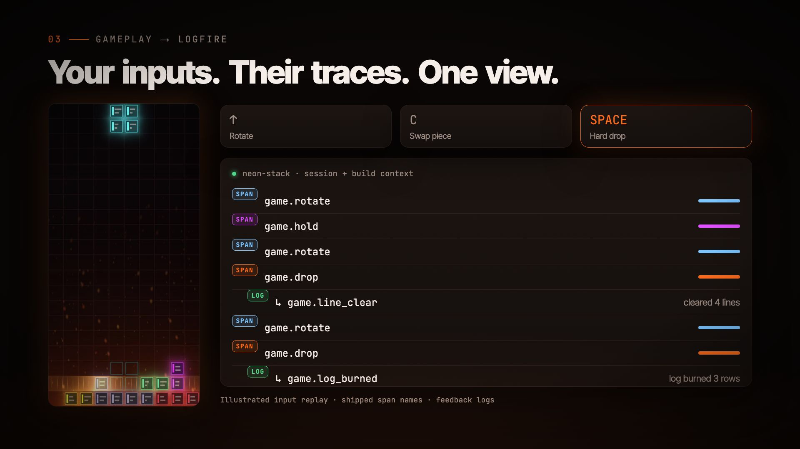

# Apple Metal + Logfire showcase

A 77-second React video built with [Remotion](https://www.remotion.dev).
It presents SDK setup, game input spans, trace correlation, a reported Log Roll FPS fix, native CPU/GPU capabilities, and a real Logfire dashboard.
The shared ember theme and animation components preserve the original reel's visual style.



The dashboard scene uses [this real Logfire view](public/apple-metal-overview.jpg).
The current image shows the verified 60-second session with callback/presentation cadence, CPU activity, slow-frame share, and queue delay.
These observations are separate from the reported FPS animation.

## Render

```sh
cd video
npm ci
npm run check
npm run render
```

The default render uses the included game poster and dashboard screenshot.
It needs no game build, credentials, or Logfire connection.
The output is `out/logfire-swift-reel.mp4` at 1920 × 1080, 30 FPS.
Rendering uses two workers to limit host load.
Use `npm run studio` to preview the React scenes.
Use `npm run still -- out/performance.png --frame=1040` for a still.

## Use moving game footage

Build the reference game in Release. Run the existing offscreen recorder through this script from the repository root:

```sh
video/record-footage.sh "$PWD/tmp/DerivedData-macos/Build/Products/Release/NeonStack.app"
cd video
npm run render:footage
```

The script records fixed-clock footage at 60 FPS and disables telemetry export.
It generates Log Roll, Flappy Log and Neon Stack clips. The current reel includes all three workloads.
These clips illustrate gameplay. They do not supply the performance figures.
The reel loops each clip's first eight seconds. Longer scenes keep moving, and all source offsets stay within the included footage.
Raw footage and rendered outputs stay outside Git.

## Data and claims

The 45 → 117 FPS animation shows the collaborator's reported Log Roll fix. See [the presentation notes](../docs/presentation.md) for the method and evidence limits.
It is an approximate one-run comparison. The original frame reports are not included, so the figure does not establish confirmed presented FPS.
The `CPUCase` composition shows the separate measured CPU comparison. Render it with `npm run render:cpu`.

`src/data.json` contains the ten measured CPU runs, their medians, and one native next-drawable capture.
Logfire queries reproduced every CPU ratio on October 8, 2026.
The real native capture contains 201 complete calls and 758.5 ms of total wall time.
Its SDK investigation window has 43.7% native coverage and 174.2 ms of overlapping drawable wait time.
The optional `NativeEvidence` composition preserves those scopes. It makes no controlled performance claim from that busy-host capture.

The trace diagram uses the current names and kinds. Operation spans and structured logs are distinct.
The input scene animates rotate, hold, and drop keys beside their existing operation spans and nested gameplay feedback logs.
Its sequence and bar lengths are illustrative. They are not a telemetry recording of the adjacent fixed-clock footage.
The `InputTrace` composition supports separate review of that scene.
The screenshot comes from the real **Apple Metal Overview** dashboard with one ingested Log Roll session.
The current overview also exposes build timing, host load, queue delays, gameplay events, and runtime/build trace links.
It contains no token or local path. Its historical records predate the `game.crash` → `game.collision` naming correction.

See [the presentation and trace review](../docs/presentation.md) and [the measured CPU case](../docs/cpu-investigation.md).
